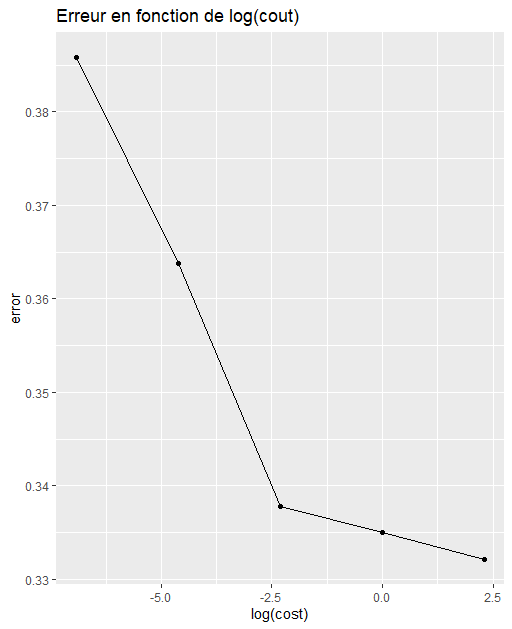
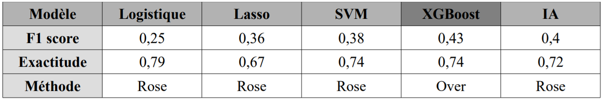

```{r setup, include=FALSE}
knitr::opts_chunk$set(echo = TRUE)
```

# Description du problème et des données
## Description du problème

* L'amour : Comment mettre en relation les personnes qui ont le plus le chance de s'aimer ?

* Données issues de SpeedDating

<center>
  
</center>

## Table des matières

* Présentation du jeu de données
* Preprocessing & Nettoyage
* Visualisation et Statistiques Descriptives
* Les modèles
* Le modèle retenu et conclusion

## Présentation de la base de données

* Base de données recupérée sur [kaggle](https://www.kaggle.com/annavictoria/speed-dating-experiment) 
* Données brutes : 
    + 8379 lignes et 195 variables
    + variable à expliquer : match
    + Variables explicatives : 73 variables de type identification

<center>
  
</center>

## Presentation de la base de données    
* Variable à expliquer *match* : 84% de 0 (pas de match entre le couple) et 16% de 1 (match) ---> données déséquilibrées
    

```{r echo=FALSE, message=FALSE, warning=FALSE, paged.print=FALSE}
library(tidyverse)
df_speed=read.csv("../DataBase/Speed Dating Data.csv")
ggplot(df_speed, aes(x = match)) +  
  geom_bar(aes(y = (..count..)/sum(..count..)))
```

## Preprocessing 

<h1> Nettoyage du jeu de données </h1>

* Gerer les problemes de codage
* Harmonser le système de points
* Gestion des valeurs manquantes 
* Suppresion de variables inutilisables pour répondre à la problématique
* Joindre les inforations

<h1> Création de nouvelles variables </h1>
* Aggréger certaines modalités des variables qualitatives
* Variable comptage
* Variables représentant la distances entre les partenaires


# Présentation et visualisation des donnees

## Présentation

* Une ligne correspond aux données de 2 individus
* Variable à expliquer *match* : 84% de 0 (pas de match entre le couple) et 16% de 1 (match) ---> données déséquilibrées
* Différents types de variables caractérisant :
    + comment les individus s'évaluent eux même (attractivité, intelligence, etc...) 
    + ce que les individus recherchent chez leur potentiel partenaire
    + centres d'intérêts des individus (cinéma, sport, etc...)


## Visualisation & Statistiques descriptives

* Corrélation : Les activités pratiquées par les femmes
<center>
  
</center>

## Visualisation & Statistiques descriptives

* Corrélation : Les activités pratiquées par les hommes
<center>
  
</center>

## Visualisation & Statistiques descriptives

* Corrélation : Ce que les personnes du même sexe qu'elle recherche
<center>
  
</center>

## Visualisation & Statistiques descriptives

* Corrélation : Rapport de corrélation entre les variables quantitatives et la variable réponse
<center>
  
</center>

## Visualisation & Statistiques descriptives

* Significativité : Test de Student pour chaque variable quantitative et la variable réponse
<center>
  
</center>

## Visualisation & Statistiques descriptives

* Corrélation : V de Cramer pour chaque variable qualitative avec la variable réponse
<center>
  
</center>


# Critères de performance
## Critères de performance
* Données déséquilibrées : 84% d'exactitude en prédisant que des 0 
* Mettre l'accent sur le taux de match détecté :
    + Precision, Sensibilité et F1-Score
    + Ne pas négliger la performance globale

## Critères de performance
<center>
  
</center>

# Régression Logistique (Modèle 1/5)
## Régression Logistique

* Modèle "naturel" pour une classification binaire
* 100+ variables --> fléau de la dimension
* Reduction du nombre de variables avec **caret**
<center>
  
</center>
* Passage de 100+ variables à 44 variables

## Premier résultat

<center>
  
</center>

* Mauvaise performance au vu de nos critères
* Hypothèse : cela est du au déséquilibre des données

## Suréchantillonage (Oversampling)

* Randomly Over Sampling Examples (ROSE) : equilibrage des données
* "Nouvelle" base d'apprentissage
* Ajustement d'un nouveau modèle et meilleurs résultats

## Résultats

{width=50%}--{width=40% height="310ps"}

* Regression Logistique normale inadaptée


# Régression de Lasso : 4 modèles (Modèle 2/5)
## Régression de Lasso : Sans sampling

* Optimisation de l'hyper-paramètre Lambda
<center>
  
</center>

## Régression de Lasso : Sans sampling

* Résultats obtenus
<center>
  
</center>

## Régression de Lasso : Avec Rose

* Optimisation de l'hyper-paramètre Lambda
<center>
  
</center>

## Régression de Lasso : Avec Rose

* Résultats obtenus
<center>
  
</center>

## Régression de Lasso : Avec Over-Sampling

* Optimisation de l'hyper-paramètre Lambda
<center>
  
</center>

## Régression de Lasso : Avec Over-Sampling

* Résultats obtenus
<center>
  
</center>

## Régression de Lasso : Avec Under-Sampling

* Optimisation de l'hyper-paramètre Lambda
<center>
  
</center>

## Régression de Lasso : Avec Under-Sampling

* Résultats obtenus
<center>
  
</center>

## Régression avec Lasso : Résumé des scores

* Tableau des scores pour différents sampling
<center>
  
</center>

# SVM (Modèle 3/5)
## SVM

* 100+ variables --> cas des données non-séparables

## Premier modèle

* Modèle SVM linéaire sur la base initiale

<center>
  
</center>

* Mauvais modèle qui classifie tous comme des couples non match parce que cela donne un taux 83.4% des couples correctement prédites    

---> Due au déséquilibre dans la base de données 

* Solution : Surechantillonage de ROSE

## Les modèles obtenus avec la nouvelle base de données d'apprentissage avec ROSE

* Modèles testés : SVM linéaire, SVM radial, SVM polynomial.

* Pour chaque modèle, on retire la précision, la sensibilité et le F1 score pour les comparer à la fin.

## SVM linéaire
* Séparation des données par un seuil linéaire
* <span class="red2">**Pénalisation**</span> de la mauvaise classification
* <span class="red2">**Cout**</span> de pénalisation à calibrer

<left>
  
</left>
<right>
  
</right>

**Meilleur modèle** : <span class="red2"> Cout = 0.1 </span>

## SVM radial
* Séparation des données par un seuil radial
* <span class="red2">**Cout**</span> de pénalisation à calibrer

<left>
  
</left>
<right>
  
</right>

**Meilleur modèle** : <span class="red2"> Cout = 0.1, Gamma = 0.01  </span>

## SVM polynomial
* Séparation des données par un seuil polynomial
* <span class="red2">**Cout**</span> de pénalisation à calibrer
* <span class="red2">**Degrès**</span> du polynome à calibrer

<left>
  
</left>
<right>
  
</right>


**Meilleur modèle** : <span class="red2"> Cout = 0.1, Degree = 3 </span>

## Comparaison des 3 modèles

<center>
  
</center>

**Meilleur modèle** : SVM polynomial de degré 3 avec le cout égal à 0.1


# XGBOOST (Modèle 4/5)

## XGBOOST
Les hyperparamètres à optimiser sont :
<ul>
<li> le nombre d'itération du boosting</li>
<li>la profondeur maximale des arbres </li>
<li>le pas de descente de gradient</li>
<li>le pourcentage de variable qu'on garde pour la construton de chaque arbre</li>
<li>la taille des sous-échantillons</li>
<li>le gain minimum pour diviser un noeud</li>
</ul>

## XGBOOST Evaluation
<div class='row' style="display: flex">
<div class="col-sm-6">
  
  <h3>Précision rappel</h3>
</div>
<div class="col-sm-6">
  
  <h3>F1-score en fonction du seuil</h3>
  </div>
</div>
## XGBOOST Matrice de confusion

<div class='row' style="display: flex">
<div class="col-sm-4">
  
  <h3>Xgboost</h3>
</div>
<div class="col-sm-3">
  
   <h4>Xgboost<br> sur-échantillonnage</h4>
  </div>
<div class="col-sm-3">
  
   <h4>Xgboost <br>sous-échantillonnage</h4>
  </div>
</div>


# Intelligence artificielle (Modèle 5/5)
## Intelligence artificielle

* Réseaux de neurones : neurones d'entrées et de sortie
* Couches de neurones cachées
* Fonction d'activation
* Fonction de coût

<center>
  
</center>


## Méthode : Fonction de perte "focal loss"


* Déséquilibre > trouver une fonction de perte adéquate
* Fonction de perte : "focal loss"
* Voici la formule pour cette fonction de perte :

<center>
  
</center>

Hyperparamètres : ${\gamma}$

    
## Méthode : Fonction de perte "focal loss"

* Architecture :
  + 3 couches (139, 97, 42)
  + Fonction d'activation : sigmoid
  + Fonction de perte : focal loss
  + gamma = 2

## Méthode : Fonction de perte "focal loss"


<center>
  
</center>*

## Méthode : poids

* Fonction de perte instable > autre solution
* Mettre des différents poids sur les classes
* Formule pour les poids :
    + nombre de la plus grande classe/nombre de la classe i
* Hyperparamètres classique d'IA
* Architecture : 
  + 3 couches (88, 16, 16)
  + Fonction d'activation : sigmoid
  + Fonction de perte : Binary crossentropy

## Méthode : poids

* F1_Score seuil 0.5 :  0.358
* F1_score meilleur seuil : 0.363

<center>
  
</center>

## Méthode ROSE

* Autres méthodes ? Rééchantillonage ROSE
* Avantage : retomber sur un cas classique d'un problème équilibré
* Architecture :
  + 3 couches (139, 97, 42)
  + Fonction d'activation : sigmoid
  + Fonction de perte : Binary crossentropy


## Méthode ROSE

* F1_Score seuil 0.5 : 0.38
* F1_score meilleur seuil : 0.395

<center>
  
</center>

## Méthode suréchantillonage

* Rééchantillonage : oversampling
* Architecture :
  + 3 couches cachées (111, 70, 21)
  + Fonction d'activation : sigmoid
  + Fonction de perte : Binary crossentropy
  
## Méthode suréchantillonage

* F1_Score seuil 0.5 : 0.38
* F1_score meilleur seuil : 0.384

<center>
  
</center>

# Comparaison des algos
## Comparaison des algos


<br/>
<br/>
<br/>


<center>
  
</center>

## Quelques mots pour comparer les algos

* Essai de combinaisaon des modèles entre IA et XGBoost
  + Vote à la majorité avec pondération et choix des meilleurs score pour maximiser le F1_score

<center>
  
</center>

# Conclusion
## Conclusion
